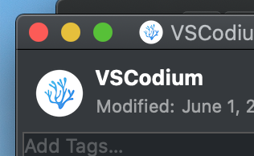

# Open-In-VSCode

## The App
This tool is a simple Finder addon in the form of an AppleScript App. When clicked, it opens a new VSCode window at the current Finder window path. If you use [VS Codium](https://github.com/VSCodium/vscodium), you can follow the same instructions with very minor adjustments.


## Installing

### Step 1: Create the App
1. Open the Automator app
2. `File` -> `New` -> `Application`
3. Under `Actions`, select `Run AppleScript`
 


4. Paste the code found in [Open-In-VSCode.applescript](./Open-In-VSCode.applescript)
    - __*NOTE:*__ If you use VSCodium, be sure to replace 
    ```
    tell application "VSCode"
    ```
    with
    ```
    tell application "VSCodium"
    ```
\
\
5. `File` -> `Save` -> Choose a location and name. I named mine `VSCodeOpenScript.app`.

### Step 2: Update the Icon
Locate the newly created app. You'll notice that by default the icon is the same as Automator. You can try to find an icon online, but I prefer to use the VSCode icon for this app as well.

6. Right click the app you just created -> `Get Info`. Do the same for `VSCode`.
7. In the info screen for `VSCode`, click the icon image in the top left-hand corner. Then, use `CMD+C` to **copy** the icon image. I use `VSCodium`, so the icon may look a little different on your machine.



8. In the info screen for your new App, click the icon image and use `CMD+V` to **paste** the new icon image.
9. Close the info screens.

### Step 3: Add the app to Finder

10. In Finder, go to the location of the app.
11. Hold `CMD` and **drag** the app to the Finder toolbar. Then, drop it once you see the green `plus` symbol. I prefer my Finder addons to be to the left of the search bar.


## Usage
Using the app is very straightforward. While in a Finder window, click the app in the Finder toolbar to launch it. A new VSCode window will open in the current directory.


### Notes and Known Issues
- If you use the Multiple Desktops feature, sometimes launching a new VSCode window via this app will switch to another Desktop. I am still not certain what causes this to happen, but it is infrequent.
- When running for the first time on macOS Mojave (10.14.0) and later, you may be prompted a one or two times for permission to
  - Access your files, or
  - Execute VSCode or Finder
