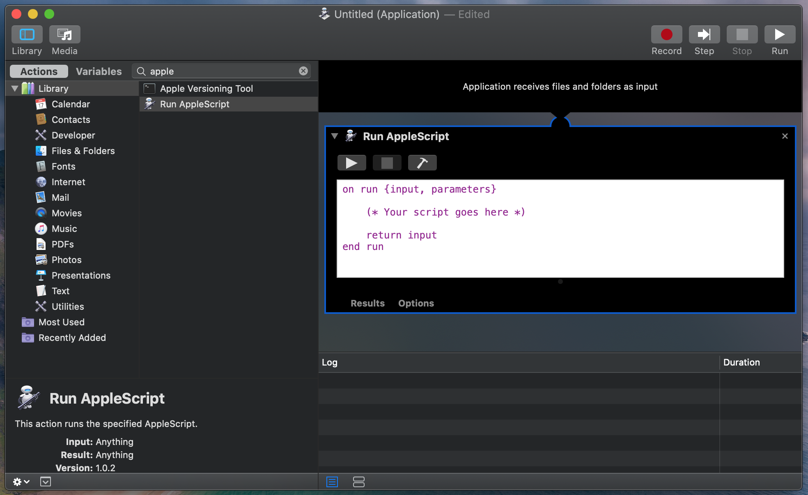
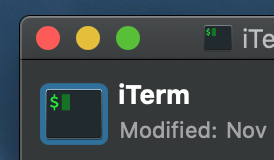

# Open-In-iTerm
This repository is to serve solely as documentation for a useful tool I have used on every Mac I have owned. I am not the creator of this tool.

## The App
This tool is a simple Finder addon in the form of an AppleScript App. When clicked, it opens a new iTerm window at the current Finder window path.

## Installing

### Step 1: Create the App
1. Open the Automator app
2. `File` -> `New` -> `Application`
3. Under `Actions`, select `Run AppleScript`

4. Paste the code found in [Main.applescript](./Open-In-iTerm.applescript)
5. `File` -> `Save` -> Choose a location and name. I named mine `iTermOpenScript.app`.

### Step 2: Update the Icon
Locate the newly created app. You'll notice that by default the icon is the same as Automator. You can try to find an icon online, but I prefer to use the iTerm icon for this app as well.

6. Right click the app -> `Get Info`. Do the same for `iTerm`.
7. In the info screen for `iTerm`, click the icon image in the top left-hand corner. Then, use `CMD+C` to **copy** the icon image.

8. In the info screen for your new App, click the icon image and use `CMD+V` to **paste** the new icon image.
9. Close the info screens.

### Step 3: Add the app to Finder

10. In Finder, go to the location of the app.
11. Hold `CMD` and **drag** the app to the Finder toolbar. Then, drop it once you see the green `plus` symbol. I prefer my Finder addons to be on the left of the search bar.

## Usage
Using the app is very straightforward. While in a Finder window, click the app in the Finder toolbar to launch it. A new iTerm window will open in the current directory.

### Notes and Known Issues
- There may be noticeable delay when one's shell profile (`bash_profile`, `zshrc` or similar) is computationally expensive.
  - For example: loading a proxy service before each terminal session
  - Basically, if your shell already takes a while to load, nothing will change here
- If you use the Multiple Desktops feature, sometimes launching a new iTerm window via this app will switch to another Desktop. I am still not certain what causes this to happen, but it is infrequent.
- When running for the first time on macOS Mojave (10.14.0) and later, you may be prompted a one or two times for permission to
  - Access your files, or
  - Execute iTerm or Finder

### Source
I am not the creator of this tool. The information outlined here is mainly based on [this Gist](https://gist.github.com/guiwuff/f99b4815785bbd8a4a5cd4d11e90fa63), among others like it.

I created this repository as a means of documentation, as well as a way to easily make updates to it in the future should any issues arise (OS changes, etc.).
